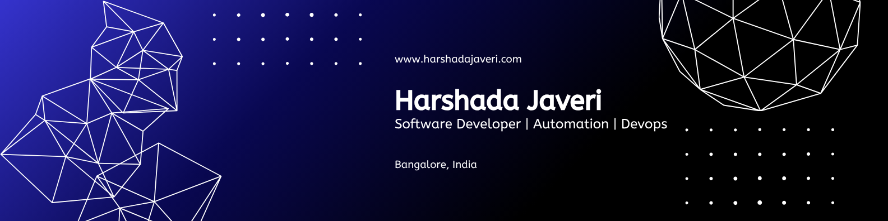
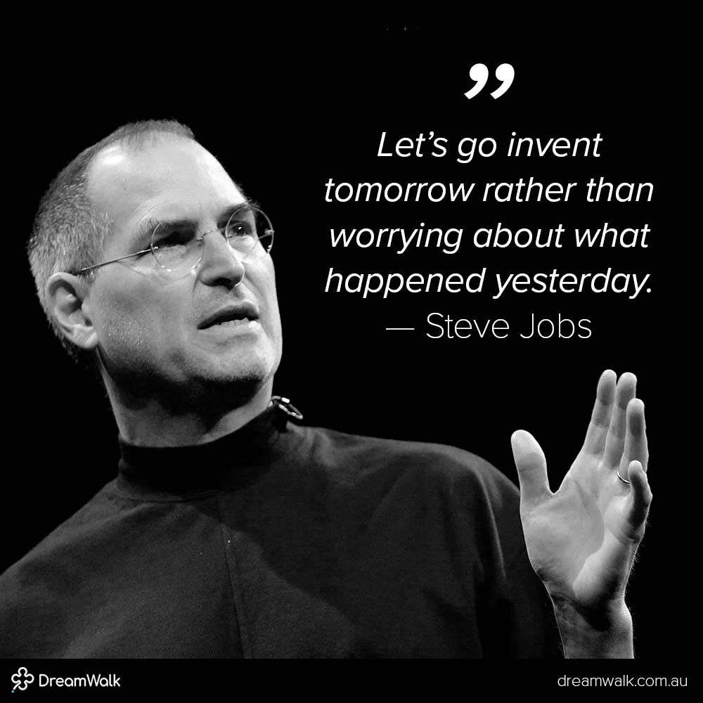

<h1 align="center">Hi there 👋, I'm Harshada Javeri</h1>
<h3 align="center">Software Development Engineer | Automation | Python Dev | System Design | Tech Storyteller</h3>

  
  
  

---

  

### 💁‍♀️ About Me

- 🔬 Software Development Engineer with 6+ years in Automation & AI  
- 🧪 Building scalable automation frameworks using Python, Playwright, Selenium  
- 📊 Expertise in DB testing, data validations with DB2, Snowflake, Pandas  
- 🌱 Currently diving deep into GenAI, LLM apps & prompt engineering  
- ✍️ Passionate about simplifying complex tech through blogs, talks & workshops  
- 🌍 Bangalore-based, working remotely on impactful projects worldwide  

---

### 💼 Tech Stack

#### Languages

#### Tools & Frameworks

#### Databases

#### DevOps & CI/CD

---

### 🔥 GitHub Stats & Activity

  
  

  

### 📘 Featured Projects

- **🧠 GenAI Practice** — Prompt Engineering, LLMs, OpenAI APIs  
- **📊 Stock Price Dashboard** — Big Tech Stocks visualization & prediction  
- **🧪 Automation Daily** — Handy scripts for Threads cleanup, Insta follower comparison, scraping  
- **🌱 100 Days of Code** — My daily journey coding in Python & JavaScript  

---

### 🎯 Fun Facts

- 🏆 First-gen female engineer  
- 🧘 Yoga, journaling & tech podcasts fuel my mornings  
- 🌻 Passionate about mentoring juniors & building scalable automation  

---

### 📌 Let's Collaborate!

If you're into open-source, fintech automation, or elevating quality testing frameworks — let's connect! 😊  
Reach out on [LinkedIn](https://www.linkedin.com/in/harshada-javeri-ai-ml-automation/) or drop me an [email](mailto:adacodes@proton.me).

---

  

